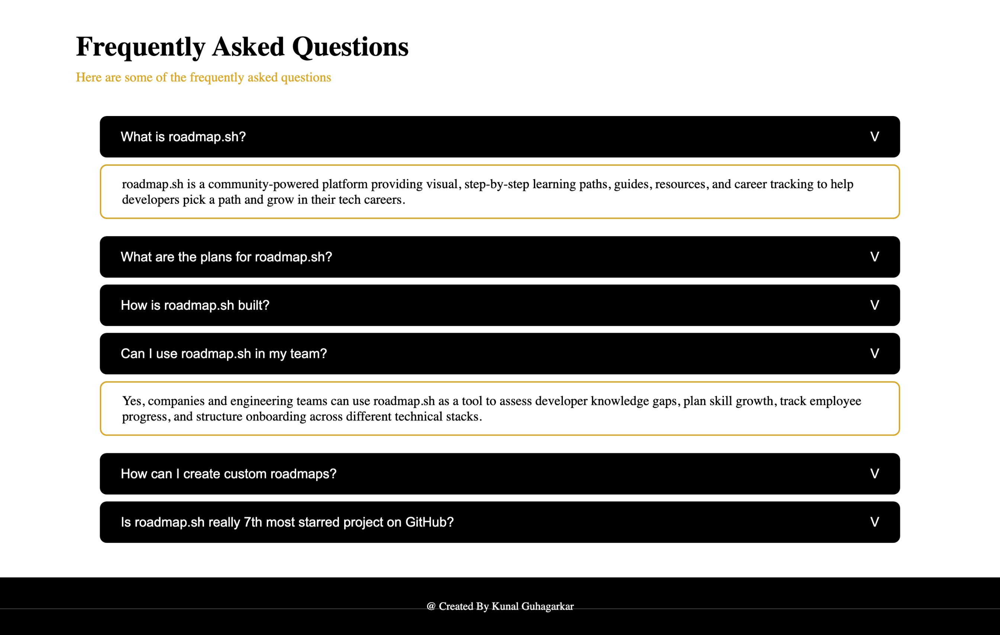

# Accordion

A simple FAQ accordion component built with **HTML**, **CSS**, and **vanilla JavaScript**. Click a question to reveal its answer, click again to hide it.

This project is a solution to the [Accordion](https://roadmap.sh/projects/accordion) beginner frontend project from [roadmap.sh](https://roadmap.sh).

## Preview



## Features

- Clean, minimal FAQ layout with a heading, question list, and footer
- Click a question to show or hide its answer
- Questions and answers are rendered dynamically from JavaScript arrays, so adding a new item is a one-line change
- Plain HTML, CSS, and JavaScript with no frameworks or dependencies

## Tech Stack

- HTML5
- CSS3 (Flexbox)
- JavaScript (DOM manipulation and event handling)

## Project Structure

```
accordion/
├── index.html   # Page structure and question containers
├── style.css    # Layout and styling
└── script.js    # Renders questions/answers and handles toggling
```

## Getting Started

No build step is needed.

1. Clone the repository:
    ```bash
    git clone https://github.com/KunalGuhagarkar/Accordion.git
    ```
2. Open the project folder:
    ```bash
    cd Accordion
    ```
3. Open `index.html` in your browser (or use a tool like the VS Code Live Server extension).

## How It Works

1. `index.html` contains six empty `.first-question-container` elements.
2. `script.js` holds two arrays, `questionArr` and `answerArr`. For each container, it injects a question button and a hidden answer box built from the matching array entries.
3. Each button has a click listener that swaps the `hide` and `show` classes on its answer container, which toggles `display: none` / `display: block`.

## Customizing

To add or change FAQs:

1. Add or edit entries in `questionArr` and `answerArr` in `script.js` (keep them in the same order).
2. Add or remove a matching `<div class="first-question-container"></div>` in `index.html`.

## Author

Created by **Kunal Guhagarkar**.

## Acknowledgements

Project idea from [roadmap.sh](https://roadmap.sh).
